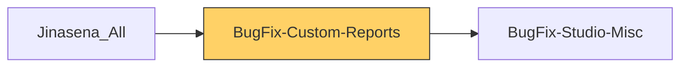

# Functional Documentation — BugFix-Custom-Reports

> Generated by `scripts/generate_functional_docs.py` from branch `Visual_Migration_02` (commit ed46a6c 2026-10-05) and the installed module on the clean environment. For every attribute: **Function** = what it does, **Depends on** = the attributes it relies on (owning module in brackets when it is not this repo), **Used by** = the attributes in any Jinasena repo that rely on it.

| Item | Value |
|---|---|
| Technical name | `BugFix-Custom-Reports` |
| Title | Jinasena : SubModule : Reporting : Custom Reports |
| Version | `17.0.0.0.20` |
| Category | Extra Tools |
| License | LGPL-3 |
| Installed on environment | installed 17.0.0.0.20 |
| History | [CHANGELOG.md](CHANGELOG.md) |

## Purpose

<!-- SUMMARY:repo -->
BugFix-Custom-Reports is the Python port of the Jinasena Reports app that was built in Studio. It gives users a Jinasena Reports menu where they record Custom Reports entries (a description, contact, responsible user, dates, value, tags, stage and notes) and view them as list, kanban, calendar, gantt, map, pivot and graph. It also carries a small Configuration list from the old Studio database. The code does not state which business team uses the reports. PDF report templates for Custom Reports live in BugFix-Studio-Misc, which also owns the detail line and tag models.

- Custom Reports records with stages, tags, value totals and multi-company visibility.
- Stage configuration under Jinasena Reports, Configuration (also linked from Documents, Configuration).
- Configuration records under Material Management, Configuration.
- Defaults for company, currency, stage, sequence and active flags for the three Jinasena companies.
- Access rights and a multi-company record rule.
- Install and migration helpers that seed missing selection values from the old database.
- Two empty placeholder models (Custom Reports Stages, Custom Reports Tags) kept from the old database.
<!-- /SUMMARY -->

## Module dependencies

| Kind | Modules |
|---|---|
| Odoo standard / enterprise | `base_setup` |
| Jinasena repos | `BugFix-Studio-Misc` |
| Third-party apps |  |
| Used by (Jinasena repos that depend on this one) | `Jinasena_All` |

## Contents at a glance

| Attribute type | Count |
|---|---|
| Models created | 5 |
| Models extended | 1 |
| Fields | 79 |
| Views | 16 |
| Window actions | 4 |
| Menus | 10 |
| Access rights | 11 |
| Record rules | 1 |
| Install hooks | 2 |
| Migration scripts | 2 |

## Models

| Model | Description | Created / extends | Fields | Views | Actions + automations | Approvals |
|---|---|---|---|---|---|---|
| `x_configuration` | Configuration | created | 20 | 3 | 0 | 0 |
| `x_custom_reports` | Custom Reports | created | 38 | 10 | 0 | 0 |
| `x_custom_reports_line_c55e7` | custom_reports_line | extends (BugFix-Studio-Misc) | 1 | 0 | 0 | 0 |
| `x_custom_reports_stage` | Custom Reports Stages | created | 8 | 3 | 0 | 0 |
| `x_custom_reports_stages` | Custom Reports Stages | created | 6 | 0 | 0 | 0 |
| `x_custom_reports_tags` | Custom Reports Tags | created | 6 | 0 | 0 | 0 |

### `x_configuration` — Configuration

*Created by this repo.* Python: `models/x_configuration.py`, `models/x_configuration_gap.py`. Record name field: `x_name`.

**Summary:**

<!-- SUMMARY:model:x_configuration -->
Purpose not evident from code. A Configuration record only has a name, sequence and active flag plus chatter; nothing in this repo reads it. It is listed under Material Management, Configuration and a TEST APP 05 menu, with a list, form and search view and full access for internal users and settings administrators.
<!-- /SUMMARY -->

**Fields (20):**

| Field | Label | Type | Function | How it gets its value | Depends on | Used by |
|---|---|---|---|---|---|---|
| `activity_calendar_event_id` | Next Activity Calendar Event | many2one → `calendar.event` | Calendar event linked to the record's next activity, if any; computed by the activity mixin. | not stored | `model calendar.event` (calendar) |  |
| `activity_date_deadline` | Next Activity Deadline | date | Deadline of the record's next scheduled activity; computed by the activity mixin. | not stored |  |  |
| `activity_exception_decoration` | Activity Exception Decoration | selection: warning=Alert; danger=Error | Computed warning level (Alert or Error) shown when an activity of an exception type exists on the record (standard activity mixin). | not stored |  |  |
| `activity_exception_icon` | Icon | char | Computed icon displayed for an exception activity on the record (standard activity mixin). | not stored |  |  |
| `activity_ids` | Activities | one2many → `mail.activity` | Scheduled activities (to-dos, calls, meetings) attached to the Configuration record, provided by the activity mixin; source for the Next Activity type, icon and summary fields. | stored | `model mail.activity` (mail) | `x_configuration.activity_summary` `x_configuration.activity_type_icon` `x_configuration.activity_type_id` |
| `activity_state` | Activity State | selection: overdue=Overdue; today=Today; planned=Planned | Computed status of the record's activities: Overdue, Today or Planned, based on the earliest activity deadline (standard activity mixin). | not stored |  |  |
| `activity_summary` | Next Activity Summary | char | Summary text of the next scheduled activity, read from the record's activities (related to `activity_ids.summary`). | related `activity_ids.summary`; not stored | `mail.activity.summary` (mail) `x_configuration.activity_ids` |  |
| `activity_type_icon` | Activity Type Icon | char | Font Awesome icon of the next activity's type, read from the record's activities (related to `activity_ids.icon`). | related `activity_ids.icon`; not stored | `mail.activity.icon` (mail) `x_configuration.activity_ids` |  |
| `activity_type_id` | Next Activity Type | many2one → `mail.activity.type` | Type of the next scheduled activity, read from the record's activities (related to `activity_ids.activity_type_id`). | related `activity_ids.activity_type_id`; not stored | `mail.activity.activity_type_id` (mail) `model mail.activity.type` (mail) `x_configuration.activity_ids` |  |
| `activity_user_id` | Responsible User | many2one → `res.users` | User responsible for the next scheduled activity on the Configuration record; computed by the activity mixin. | not stored | `model res.users` (base) |  |
| `create_date` | Created on | datetime | Date and time the Configuration record was created; set automatically. | stored |  |  |
| `create_uid` | Created by | many2one → `res.users` | User who created the Configuration record; set automatically. | stored | `model res.users` (base) |  |
| `display_name` | Display Name | char | Name shown for the Configuration record in lists and dropdowns, computed automatically by Odoo. | not stored |  |  |
| `id` | ID | integer | Unique database identifier of the Configuration record, assigned automatically. | stored |  |  |
| `my_activity_date_deadline` | My Activity Deadline | date | Deadline of the next activity assigned to the current user on this record; computed by the activity mixin. | not stored |  |  |
| `write_date` | Last Updated on | datetime | Date and time the Configuration record was last modified; set automatically. | stored |  |  |
| `write_uid` | Last Updated by | many2one → `res.users` | User who last modified the Configuration record; set automatically. | stored | `model res.users` (base) |  |
| `x_active` | Active | boolean | Archive flag for Configuration records; inactive records show an Archived ribbon and appear only under the Archived search filter. Has a default value set via ir.default. | stored |  | `default BugFix-Custom-Reports.default_235_x_configuration_x_active` `view BugFix-Custom-Reports.view_3247_default_form_view_for_x_configuration_e` `view BugFix-Custom-Reports.view_3248_default_search_view_for_x_configuration_e` |
| `x_name` | Name | char | Name of the Configuration record, entered by the user (required on the form) and shown in the list and search. | stored |  | `view BugFix-Custom-Reports.view_3246_default_list_view_for_x_configuration_e` `view BugFix-Custom-Reports.view_3247_default_form_view_for_x_configuration_e` `view BugFix-Custom-Reports.view_3248_default_search_view_for_x_configuration_e` |
| `x_studio_sequence` | Sequence | integer | Sort order of Configuration records, set by the drag handle in the list view; has a default value set via ir.default. | stored |  | `default BugFix-Custom-Reports.default_236_x_configuration_x_studio_sequence` `view BugFix-Custom-Reports.view_3246_default_list_view_for_x_configuration_e` |

**Window actions (2):**

| Name | Record name | Function | Depends on | Used by |
|---|---|---|---|---|
| Configuration | `act_window_1564_configuration` | Opens **Configuration** records (tree,form). | `model x_configuration` | `menu BugFix-Custom-Reports.menu_f6_configuration` |
| x_configuration | `act_window_2657_x_configuration` | Opens **Configuration** records (tree,form). | `model x_configuration` | `menu BugFix-Custom-Reports.menu_f6r2_test_app_05_x_configuration` |

**Views (3):**

| Name | Record name | Type | What it changes | Function | Depends on | Used by |
|---|---|---|---|---|---|---|
| Default form view for x_configuration | `view_3247_default_form_view_for_x_configuration_e` | form | full form layout with 2 fields | Configuration form: Name as the title with an Archived ribbon for inactive records; groups are empty and the chatter area is empty because its fields were stripped during porting. | `x_configuration.x_active` `x_configuration.x_name` |  |
| Default list view for x_configuration | `view_3246_default_list_view_for_x_configuration_e` | tree | full tree layout with 2 fields | Configuration list showing Name with a drag handle to reorder by Sequence. | `x_configuration.x_name` `x_configuration.x_studio_sequence` |  |
| Default search view for x_configuration | `view_3248_default_search_view_for_x_configuration_e` | search | full search layout with 1 fields | Configuration search: search by Name plus an Archived filter. | `x_configuration.x_active` `x_configuration.x_name` |  |

**Access rights (3):**

| Name | Record name | Function | Depends on | Used by |
|---|---|---|---|---|
| Configuration group_system | `access_1431_configuration_group_system` | Gives **Administration / Settings** read/write/create/delete access to Configuration records. | `group base.group_system` (base) `model x_configuration` |  |
| Configuration group_user | `access_1432_configuration_group_user` | Gives **User types / Internal User** no access to Configuration records. | `group base.group_user` (base) `model x_configuration` |  |
| x_configuration user access | `access_x_configuration_user` | Gives **User types / Internal User** read/write/create/delete access to Configuration records. | `group base.group_user` (base) `model x_configuration` |  |

### `x_custom_reports` — Custom Reports

*Created by this repo.* Python: `models/x_custom_reports.py`, `models/x_custom_reports_gap.py`. Record name field: `x_name`.

Other repos that use this model: `report BugFix-Studio-Misc.action_report_3368_custom_reports_report` (BugFix-Studio-Misc) `report BugFix-Studio-Misc.action_report_3435_custom_reports_report` (BugFix-Studio-Misc) `report BugFix-Studio-Misc.action_report_3436_custom_reports_report` (BugFix-Studio-Misc)

**Summary:**

<!-- SUMMARY:model:x_custom_reports -->
A Custom Reports record is an entry in the Jinasena Reports app with a description, contact with phone and email, responsible user, date and start and end dates, numeric value, tags, notes, stage and company. Users open it from Jinasena Reports, Jinasena Custom Reports and can browse it as list, form, kanban grouped by stage, calendar, gantt, map, pivot and graph, with detail lines in a Details tab. Company, currency and stage are defaulted per company, and a global record rule limits records to the user's companies. PDF report actions in BugFix-Studio-Misc print from it.
<!-- /SUMMARY -->

**Fields (38):**

| Field | Label | Type | Function | How it gets its value | Depends on | Used by |
|---|---|---|---|---|---|---|
| `activity_calendar_event_id` | Next Activity Calendar Event | many2one → `calendar.event` | Calendar event linked to the record's next activity, if any; computed by the activity mixin. | not stored | `model calendar.event` (calendar) |  |
| `activity_date_deadline` | Next Activity Deadline | date | Deadline of the record's next scheduled activity; computed by the activity mixin. | not stored |  |  |
| `activity_exception_decoration` | Activity Exception Decoration | selection: warning=Alert; danger=Error | Computed warning level (Alert or Error) shown when an activity of an exception type exists on the record (standard activity mixin). | not stored |  |  |
| `activity_exception_icon` | Icon | char | Computed icon displayed for an exception activity on the record (standard activity mixin). | not stored |  |  |
| `activity_ids` | Activities | one2many → `mail.activity` | Scheduled activities (to-dos, calls, meetings) attached to the Custom Reports record, provided by the activity mixin; source for the Next Activity type, icon and summary fields. | stored | `model mail.activity` (mail) | `x_custom_reports.activity_summary` `x_custom_reports.activity_type_icon` `x_custom_reports.activity_type_id` |
| `activity_state` | Activity State | selection: overdue=Overdue; today=Today; planned=Planned | Computed status of the record's activities: Overdue, Today or Planned, based on the earliest activity deadline (standard activity mixin). | not stored |  |  |
| `activity_summary` | Next Activity Summary | char | Summary text of the next scheduled activity, read from the record's activities (related to `activity_ids.summary`). | related `activity_ids.summary`; not stored | `mail.activity.summary` (mail) `x_custom_reports.activity_ids` |  |
| `activity_type_icon` | Activity Type Icon | char | Font Awesome icon of the next activity's type, read from the record's activities (related to `activity_ids.icon`). | related `activity_ids.icon`; not stored | `mail.activity.icon` (mail) `x_custom_reports.activity_ids` |  |
| `activity_type_id` | Next Activity Type | many2one → `mail.activity.type` | Type of the next scheduled activity, read from the record's activities (related to `activity_ids.activity_type_id`). | related `activity_ids.activity_type_id`; not stored | `mail.activity.activity_type_id` (mail) `model mail.activity.type` (mail) `x_custom_reports.activity_ids` |  |
| `activity_user_id` | Responsible User | many2one → `res.users` | User responsible for the next scheduled activity on the Custom Reports record; computed by the activity mixin. | not stored | `model res.users` (base) |  |
| `create_date` | Created on | datetime | Date and time the Custom Reports record was created; set automatically. | stored |  |  |
| `create_uid` | Created by | many2one → `res.users` | User who created the Custom Reports record; set automatically. | stored | `model res.users` (base) |  |
| `display_name` | Display Name | char | Name shown for the Custom Reports record in lists and dropdowns, computed automatically by Odoo. | not stored |  |  |
| `id` | ID | integer | Unique database identifier of the Custom Reports record, assigned automatically. | stored |  |  |
| `my_activity_date_deadline` | My Activity Deadline | date | Deadline of the next activity assigned to the current user on this record; computed by the activity mixin. | not stored |  |  |
| `write_date` | Last Updated on | datetime | Date and time the Custom Reports record was last modified; set automatically. | stored |  |  |
| `write_uid` | Last Updated by | many2one → `res.users` | User who last modified the Custom Reports record; set automatically. | stored | `model res.users` (base) |  |
| `x_active` | Active | boolean | Archive flag for Custom Reports records; inactive records show an Archived ribbon and appear only under the Archived search filter. Has a default value set via ir.default. | stored |  | `default BugFix-Custom-Reports.default_587_x_custom_reports_x_active` `view BugFix-Custom-Reports.view_8629_default_form_view_for_x_custom_reports_e` `view BugFix-Custom-Reports.view_8630_default_search_view_for_x_custom_reports_e` |
| `x_color` | Color | integer | Color index of the Custom Reports record, chosen with the color picker in the list and used to color the kanban card. | stored |  | `view BugFix-Custom-Reports.view_8628_default_list_view_for_x_custom_reports_e` `view BugFix-Custom-Reports.view_8633_default_kanban_view_for_x_custom_reports_e` |
| `x_custom_reports_line_ids_7ee39` | New Lines | one2many → `x_custom_reports_line_c55e7` | Detail lines (custom_reports_line records) belonging to this Custom Reports record, shown in the Details tab of the form; inverse of the lines' X Custom Reports field. | stored | `model x_custom_reports_line_c55e7` (BugFix-Studio-Misc) | `view BugFix-Custom-Reports.view_8629_default_form_view_for_x_custom_reports_e` |
| `x_name` | Description | char | Description/title of the Custom Reports record, entered by the user (required on the form); shown in list, kanban and search. | stored; required |  | `view BugFix-Custom-Reports.view_8628_default_list_view_for_x_custom_reports_e` `view BugFix-Custom-Reports.view_8629_default_form_view_for_x_custom_reports_e` `view BugFix-Custom-Reports.view_8630_default_search_view_for_x_custom_reports_e` `view BugFix-Custom-Reports.view_8633_default_kanban_view_for_x_custom_reports_e` |
| `x_studio_company_id` | Company | many2one → `res.company` | Company the Custom Reports record belongs to; defaulted via ir.default and used by the multi-company record rule to restrict visibility. Shown only to multi-company users. | stored | `model res.company` (base) | `default BugFix-Custom-Reports.default_588_x_custom_reports_x_studio_company_id` `default BugFix-Custom-Reports.default_589_x_custom_reports_x_studio_company_id` `default BugFix-Custom-Reports.default_590_x_custom_reports_x_studio_company_id` `record rule BugFix-Custom-Reports.rule_880_custom_reports_multi_company` `view BugFix-Custom-Reports.view_8628_default_list_view_for_x_custom_reports_e`

+1 more
`view BugFix-Custom-Reports.view_8629_default_form_view_for_x_custom_reports_e`
 |
| `x_studio_currency_id` | Currency | many2one → `res.currency` | Currency for the Value amount; defaulted via ir.default and kept hidden on the form and list. | stored | `model res.currency` (base) | `default BugFix-Custom-Reports.default_591_x_custom_reports_x_studio_currency_id` `default BugFix-Custom-Reports.default_592_x_custom_reports_x_studio_currency_id` `default BugFix-Custom-Reports.default_593_x_custom_reports_x_studio_currency_id` `view BugFix-Custom-Reports.view_8628_default_list_view_for_x_custom_reports_e` `view BugFix-Custom-Reports.view_8629_default_form_view_for_x_custom_reports_e`

+1 more
`view BugFix-Custom-Reports.view_8633_default_kanban_view_for_x_custom_reports_e`
 |
| `x_studio_date` | Date | date | Date entered on the Custom Reports record; used by the calendar view, the Date search filter and as the row grouping in the pivot. | stored |  | `view BugFix-Custom-Reports.view_8629_default_form_view_for_x_custom_reports_e` `view BugFix-Custom-Reports.view_8630_default_search_view_for_x_custom_reports_e` `view BugFix-Custom-Reports.view_8635_default_pivot_view_for_x_custom_reports_e` |
| `x_studio_date_start` | Start Date | datetime | Start date/time of the record, entered with the Dates range widget on the form; drives the gantt view start and the Start Date filter. | stored |  | `view BugFix-Custom-Reports.view_8629_default_form_view_for_x_custom_reports_e` `view BugFix-Custom-Reports.view_8630_default_search_view_for_x_custom_reports_e` |
| `x_studio_date_stop` | End Date | datetime | End date/time of the record, filled through the Dates range widget (hidden on its own); drives the gantt view end and the End Date filter. | stored |  | `view BugFix-Custom-Reports.view_8629_default_form_view_for_x_custom_reports_e` `view BugFix-Custom-Reports.view_8630_default_search_view_for_x_custom_reports_e` |
| `x_studio_image` | Image | binary | Image of the record, shown on kanban cards; removed from the form by the Studio customization view. | stored |  | `view BugFix-Custom-Reports.view_8629_default_form_view_for_x_custom_reports_e` `view BugFix-Custom-Reports.view_8633_default_kanban_view_for_x_custom_reports_e` |
| `x_studio_kanban_state` | Kanban State | selection: normal=In Progress; done=Ready; blocked=Blocked | Kanban status (In Progress, Ready, Blocked) shown on kanban cards and driving the kanban progress bar; removed from the form by the Studio customization view. | stored |  | `view BugFix-Custom-Reports.view_8629_default_form_view_for_x_custom_reports_e` `view BugFix-Custom-Reports.view_8633_default_kanban_view_for_x_custom_reports_e` |
| `x_studio_notes` | Notes | html | Free-form rich-text notes entered on the Custom Reports form. | stored |  | `view BugFix-Custom-Reports.view_8629_default_form_view_for_x_custom_reports_e` |
| `x_studio_partner_email` | Email | char | Email address entered on the Custom Reports form, displayed with the email widget; a plain field, not linked to the Contact. | stored |  | `view BugFix-Custom-Reports.view_8629_default_form_view_for_x_custom_reports_e` |
| `x_studio_partner_id` | Contact | many2one → `res.partner` | Contact linked to the Custom Reports record; shown in list and form, searchable including child contacts, groupable, and used to place records on the map view. | stored | `model res.partner` (base) | `view BugFix-Custom-Reports.view_8628_default_list_view_for_x_custom_reports_e` `view BugFix-Custom-Reports.view_8629_default_form_view_for_x_custom_reports_e` `view BugFix-Custom-Reports.view_8630_default_search_view_for_x_custom_reports_e` `view BugFix-Custom-Reports.view_8634_default_map_view_for_x_custom_reports_e` |
| `x_studio_partner_phone` | Phone | char | Phone number entered on the Custom Reports form, displayed with the phone/SMS widget; a plain field, not linked to the Contact. | stored |  | `view BugFix-Custom-Reports.view_8629_default_form_view_for_x_custom_reports_e` |
| `x_studio_priority` | High Priority | boolean | High Priority star on kanban cards; starred records are sorted first in the kanban view. | stored |  | `view BugFix-Custom-Reports.view_8633_default_kanban_view_for_x_custom_reports_e` |
| `x_studio_sequence` | Sequence | integer | Sort order used in the kanban view after priority; has a default value set via ir.default. | stored |  | `default BugFix-Custom-Reports.default_594_x_custom_reports_x_studio_sequence` |
| `x_studio_stage_id` | Stage | many2one → `x_custom_reports_stage` | Current stage of the Custom Reports record, shown as a clickable statusbar on the form; the kanban is grouped by it, it is a pivot column and has a default via ir.default. | stored | `model x_custom_reports_stage` | `default BugFix-Custom-Reports.default_595_x_custom_reports_x_studio_stage_id` `view BugFix-Custom-Reports.view_8629_default_form_view_for_x_custom_reports_e` `view BugFix-Custom-Reports.view_8630_default_search_view_for_x_custom_reports_e` `view BugFix-Custom-Reports.view_8635_default_pivot_view_for_x_custom_reports_e` |
| `x_studio_tag_ids` | Tags | many2many → `x_custom_reports_tag` | Tags (x_custom_reports_tag records) assigned to the record, displayed as colored tags in list, form and kanban and searchable. | stored | `model x_custom_reports_tag` (BugFix-Studio-Misc) | `view BugFix-Custom-Reports.view_8628_default_list_view_for_x_custom_reports_e` `view BugFix-Custom-Reports.view_8629_default_form_view_for_x_custom_reports_e` `view BugFix-Custom-Reports.view_8630_default_search_view_for_x_custom_reports_e` `view BugFix-Custom-Reports.view_8633_default_kanban_view_for_x_custom_reports_e` |
| `x_studio_user_id` | Responsible | many2one → `res.users` | User responsible for the Custom Reports record; shown with avatar in list, form and kanban, and used by the My Custom Reports filter and Responsible grouping. | stored | `model res.users` (base) | `view BugFix-Custom-Reports.view_8628_default_list_view_for_x_custom_reports_e` `view BugFix-Custom-Reports.view_8629_default_form_view_for_x_custom_reports_e` `view BugFix-Custom-Reports.view_8630_default_search_view_for_x_custom_reports_e` `view BugFix-Custom-Reports.view_8633_default_kanban_view_for_x_custom_reports_e` |
| `x_studio_value` | Value | float | Numeric value of the record, totalled in the list, summed in the kanban progress bar and used as the measure in the pivot and graph views. | stored |  | `view BugFix-Custom-Reports.view_8628_default_list_view_for_x_custom_reports_e` `view BugFix-Custom-Reports.view_8629_default_form_view_for_x_custom_reports_e` `view BugFix-Custom-Reports.view_8633_default_kanban_view_for_x_custom_reports_e` `view BugFix-Custom-Reports.view_8635_default_pivot_view_for_x_custom_reports_e` `view BugFix-Custom-Reports.view_8636_default_graph_view_for_x_custom_reports_e` |

**Window actions (1):**

| Name | Record name | Function | Depends on | Used by |
|---|---|---|---|---|
| Jinasena Custom Reports | `act_window_3347_jinasena_custom_reports` | Opens **Custom Reports** records (form,calendar,gantt,map,pivot,graph,tree). | `model x_custom_reports` | `menu BugFix-Custom-Reports.menu_f6r3_jinasena_reports_jinasena_custom_reports` |

**Views (10):**

| Name | Record name | Type | What it changes | Function | Depends on | Used by |
|---|---|---|---|---|---|---|
| Default calendar view for x_custom_reports | `view_8631_default_calendar_view_for_x_custom_reports_e` | calendar | full calendar layout with 0 fields | Calendar view of Custom Reports placed on the Date field; quick-create fills the Description. |  |  |
| Default form view for x_custom_reports | `view_8629_default_form_view_for_x_custom_reports_e` | form | full form layout with 18 fields | Custom Reports form: stage statusbar, title, contact/phone/email, dates, responsible, value, tags, company, notes and a Details tab with lines; chatter fields were stripped so the chatter area is empty. | `group base.group_multi_company` (base) `x_custom_reports.x_active` `x_custom_reports.x_custom_reports_line_ids_7ee39` `x_custom_reports.x_name` `x_custom_reports.x_studio_company_id`

+14 more
`x_custom_reports.x_studio_currency_id` `x_custom_reports.x_studio_date_start` `x_custom_reports.x_studio_date_stop` `x_custom_reports.x_studio_date` `x_custom_reports.x_studio_image` `x_custom_reports.x_studio_kanban_state` `x_custom_reports.x_studio_notes` `x_custom_reports.x_studio_partner_email` `x_custom_reports.x_studio_partner_id` `x_custom_reports.x_studio_partner_phone` `x_custom_reports.x_studio_stage_id` `x_custom_reports.x_studio_tag_ids` `x_custom_reports.x_studio_user_id` `x_custom_reports.x_studio_value`
 | `view BugFix-Custom-Reports.view_final_x_custom_reports_odoo_studio_default_form_view_for_x_custom_reports_customiza` |
| Default gantt view for x_custom_reports | `view_8632_default_gantt_view_for_x_custom_reports_e` | gantt | full gantt layout with 0 fields | Gantt view of Custom Reports spanning Start Date to End Date. |  |  |
| Default graph view for x_custom_reports | `view_8636_default_graph_view_for_x_custom_reports_e` | graph | full graph layout with 2 fields | Graph view of Custom Reports plotting total Value by creation date. | `x_custom_reports.x_studio_value` |  |
| Default kanban view for x_custom_reports | `view_8633_default_kanban_view_for_x_custom_reports_e` | kanban | full kanban layout with 9 fields | Kanban of Custom Reports grouped by Stage, with a progress bar by kanban state summing Value; cards show image, priority star, title, tags, value, state and a colour menu. | `x_custom_reports.x_color` `x_custom_reports.x_name` `x_custom_reports.x_studio_currency_id` `x_custom_reports.x_studio_image` `x_custom_reports.x_studio_kanban_state`

+4 more
`x_custom_reports.x_studio_priority` `x_custom_reports.x_studio_tag_ids` `x_custom_reports.x_studio_user_id` `x_custom_reports.x_studio_value`
 |  |
| Default list view for x_custom_reports | `view_8628_default_list_view_for_x_custom_reports_e` | tree | full tree layout with 8 fields | Custom Reports list: Description, Contact, Responsible, Company (multi-company only), Value with total, Tags and colour picker. | `group base.group_multi_company` (base) `x_custom_reports.x_color` `x_custom_reports.x_name` `x_custom_reports.x_studio_company_id` `x_custom_reports.x_studio_currency_id`

+4 more
`x_custom_reports.x_studio_partner_id` `x_custom_reports.x_studio_tag_ids` `x_custom_reports.x_studio_user_id` `x_custom_reports.x_studio_value`
 |  |
| Default map view for x_custom_reports | `view_8634_default_map_view_for_x_custom_reports_e` | map | full map layout with 1 fields | Map view placing Custom Reports records at their Contact's address. | `x_custom_reports.x_studio_partner_id` |  |
| Default pivot view for x_custom_reports | `view_8635_default_pivot_view_for_x_custom_reports_e` | pivot | full pivot layout with 3 fields | Pivot view of Custom Reports summing Value by Date (rows) and Stage (columns). | `x_custom_reports.x_studio_date` `x_custom_reports.x_studio_stage_id` `x_custom_reports.x_studio_value` |  |
| Default search view for x_custom_reports | `view_8630_default_search_view_for_x_custom_reports_e` | search | full search layout with 8 fields | Custom Reports search: find by description, contact, responsible or tags; filters My Custom Reports, Date/Start/End date and Archived; group by Partner, Responsible or Stage. | `x_custom_reports.x_active` `x_custom_reports.x_name` `x_custom_reports.x_studio_date_start` `x_custom_reports.x_studio_date_stop` `x_custom_reports.x_studio_date`

+4 more
`x_custom_reports.x_studio_partner_id` `x_custom_reports.x_studio_stage_id` `x_custom_reports.x_studio_tag_ids` `x_custom_reports.x_studio_user_id`
 |  |
| Odoo Studio: Default form view for x_custom_reports customization | `view_final_x_custom_reports_odoo_studio_default_form_view_for_x_custom_reports_customiza` | form | remove `//field[@name='x_studio_image']`; remove `//field[@name='x_studio_kanban_state']` | Studio customization of the Custom Reports form that removes the Image and Kanban State fields from the form. | `view BugFix-Custom-Reports.view_8629_default_form_view_for_x_custom_reports_e` |  |

**Access rights (3):**

| Name | Record name | Function | Depends on | Used by |
|---|---|---|---|---|
| Custom Reports group_system | `access_8259_custom_reports_group_system` | Gives **Administration / Settings** read/write/create/delete access to Custom Reports records. | `group base.group_system` (base) `model x_custom_reports` |  |
| Custom Reports group_user | `access_8260_custom_reports_group_user` | Gives **User types / Internal User** read/write/create access to Custom Reports records. | `group base.group_user` (base) `model x_custom_reports` |  |
| x_custom_reports user access | `access_x_custom_reports_user` | Gives **User types / Internal User** read/write/create/delete access to Custom Reports records. | `group base.group_user` (base) `model x_custom_reports` |  |

**Record rules (1):**

| Name | Record name | Function | Depends on | Used by |
|---|---|---|---|---|
| Custom Reports - Multi-Company | `rule_880_custom_reports_multi_company` | For everyone (global rule): read/write/create/delete on Custom Reports only where `['|', ('x_studio_company_id', '=', False), ('x_studio_company_id', 'in', company_ids)]`. | `model x_custom_reports` `x_custom_reports.x_studio_company_id` |  |

### `x_custom_reports_line_c55e7` — custom_reports_line

*Extends a model created by `BugFix-Studio-Misc`.* Python: `models/x_custom_reports_line_c55e7.py`.

Other repos that use this model: `access right BugFix-Studio-Misc.access_8261_custom_reports_line_group_system` (BugFix-Studio-Misc) `access right BugFix-Studio-Misc.access_8262_custom_reports_line_group_user` (BugFix-Studio-Misc) `access right BugFix-Studio-Misc.access_x_custom_reports_line_c55e7_admin` (BugFix-Studio-Misc)

**Summary:**

<!-- SUMMARY:model:x_custom_reports_line_c55e7 -->
This repo adds only the link back from a detail line to its parent Custom Reports record (X Custom Reports). The field is declared here rather than in BugFix-Studio-Misc, which owns the line model, so the link does not break to an _unknown model during upgrades.
<!-- /SUMMARY -->

**Fields (1):**

| Field | Label | Type | Function | How it gets its value | Depends on | Used by |
|---|---|---|---|---|---|---|
| `x_custom_reports_id` | X Custom Reports | many2one → `x_custom_reports` | Parent Custom Reports record of a detail line; inverse of the parent's New Lines field. Declared in this module so the link does not break to an `_unknown` model during upgrades. | stored | `model x_custom_reports` |  |

### `x_custom_reports_stage` — Custom Reports Stages

*Created by this repo.* Python: `models/x_custom_reports_stage.py`, `models/x_custom_reports_stage_gap.py`. Record name field: `x_name`.

**Summary:**

<!-- SUMMARY:model:x_custom_reports_stage -->
A Custom Reports Stage is a named, ordered step that forms the statusbar and kanban columns of Custom Reports records. Stages are maintained in an editable drag-to-reorder list under Jinasena Reports, Configuration, and stage 1 is the default for new reports.
<!-- /SUMMARY -->

**Fields (8):**

| Field | Label | Type | Function | How it gets its value | Depends on | Used by |
|---|---|---|---|---|---|---|
| `create_date` | Created on | datetime | Date and time the Custom Reports Stage record was created; set automatically. | stored |  |  |
| `create_uid` | Created by | many2one → `res.users` | User who created the Custom Reports Stage record; set automatically. | stored | `model res.users` (base) |  |
| `display_name` | Display Name | char | Name shown for the Custom Reports Stage record in lists and dropdowns, computed automatically by Odoo. | not stored |  |  |
| `id` | ID | integer | Unique database identifier of the Custom Reports Stage record, assigned automatically. | stored |  |  |
| `write_date` | Last Updated on | datetime | Date and time the Custom Reports Stage record was last modified; set automatically. | stored |  |  |
| `write_uid` | Last Updated by | many2one → `res.users` | User who last modified the Custom Reports Stage record; set automatically. | stored | `model res.users` (base) |  |
| `x_name` | Stage Name | char | Name of a Custom Reports stage, entered by the user (required); stages form the statusbar and kanban columns of Custom Reports. | stored; required |  | `view BugFix-Custom-Reports.view_8640_default_list_view_for_x_custom_reports_stage_e` `view BugFix-Custom-Reports.view_8641_default_form_view_for_x_custom_reports_stage_e` `view BugFix-Custom-Reports.view_8642_default_search_view_for_x_custom_reports_stage_e` |
| `x_studio_sequence` | Sequence | integer | Order of Custom Reports stages, set by the drag handle in the editable stage list. | stored |  | `view BugFix-Custom-Reports.view_8640_default_list_view_for_x_custom_reports_stage_e` |

**Window actions (1):**

| Name | Record name | Function | Depends on | Used by |
|---|---|---|---|---|
| Jinasena Custom Reports Stages | `act_window_3348_jinasena_custom_reports_stages` | Opens **Custom Reports Stages** records (tree,form). | `model x_custom_reports_stage` | `menu BugFix-Custom-Reports.menu_f6_jinasena_custom_reports_stages` `menu BugFix-Custom-Reports.menu_f6r3_jinasena_reports_configuration_jinasena_custom_reports_stage` |

**Views (3):**

| Name | Record name | Type | What it changes | Function | Depends on | Used by |
|---|---|---|---|---|---|---|
| Default form view for x_custom_reports_stage | `view_8641_default_form_view_for_x_custom_reports_stage_e` | form | full form layout with 1 fields | Custom Reports Stage form with only the Stage Name as title; the other groups are empty. | `x_custom_reports_stage.x_name` |  |
| Default list view for x_custom_reports_stage | `view_8640_default_list_view_for_x_custom_reports_stage_e` | tree | full tree layout with 2 fields | Editable list of Custom Reports stages with a drag handle for ordering and Stage Name. | `x_custom_reports_stage.x_name` `x_custom_reports_stage.x_studio_sequence` |  |
| Default search view for x_custom_reports_stage | `view_8642_default_search_view_for_x_custom_reports_stage_e` | search | full search layout with 1 fields | Custom Reports Stage search by Stage Name. | `x_custom_reports_stage.x_name` |  |

**Access rights (3):**

| Name | Record name | Function | Depends on | Used by |
|---|---|---|---|---|
| Custom Reports Stages group_system | `access_8263_custom_reports_stages_group_system` | Gives **Administration / Settings** read/write/create/delete access to Custom Reports Stages records. | `group base.group_system` (base) `model x_custom_reports_stage` |  |
| Custom Reports Stages group_user | `access_8264_custom_reports_stages_group_user` | Gives **User types / Internal User** read/write/create access to Custom Reports Stages records. | `group base.group_user` (base) `model x_custom_reports_stage` |  |
| x_custom_reports_stage user access | `access_x_custom_reports_stage_user` | Gives **User types / Internal User** read/write/create/delete access to Custom Reports Stages records. | `group base.group_user` (base) `model x_custom_reports_stage` |  |

### `x_custom_reports_stages` — Custom Reports Stages

*Created by this repo.* Python: `models/x_custom_reports_stages.py`.

**Summary:**

<!-- SUMMARY:model:x_custom_reports_stages -->
Purpose not evident from code. The model has only a description and the automatic Odoo fields, no views or menus, and one access right giving internal users full access. Custom Reports use x_custom_reports_stage for their stages instead.
<!-- /SUMMARY -->

**Fields (6):**

| Field | Label | Type | Function | How it gets its value | Depends on | Used by |
|---|---|---|---|---|---|---|
| `create_date` | Created on | datetime | Date and time the x_custom_reports_stages record was created; set automatically. This model has no business fields and is not used by Custom Reports, which uses `x_custom_reports_stage`. | stored |  |  |
| `create_uid` | Created by | many2one → `res.users` | User who created the x_custom_reports_stages record; set automatically. This model has no business fields and is not used by Custom Reports, which uses `x_custom_reports_stage`. | stored | `model res.users` (base) |  |
| `display_name` | Display Name | char | Name shown for the x_custom_reports_stages record in lists and dropdowns, computed automatically by Odoo. This model has no business fields and is not used by Custom Reports, which uses `x_custom_reports_stage`. | not stored |  |  |
| `id` | ID | integer | Unique database identifier of the x_custom_reports_stages record, assigned automatically. This model has no business fields and is not used by Custom Reports, which uses `x_custom_reports_stage`. | stored |  |  |
| `write_date` | Last Updated on | datetime | Date and time the x_custom_reports_stages record was last modified; set automatically. This model has no business fields and is not used by Custom Reports, which uses `x_custom_reports_stage`. | stored |  |  |
| `write_uid` | Last Updated by | many2one → `res.users` | User who last modified the x_custom_reports_stages record; set automatically. This model has no business fields and is not used by Custom Reports, which uses `x_custom_reports_stage`. | stored | `model res.users` (base) |  |

**Access rights (1):**

| Name | Record name | Function | Depends on | Used by |
|---|---|---|---|---|
| x_custom_reports_stages user access | `access_x_custom_reports_stages_user` | Gives **User types / Internal User** read/write/create/delete access to Custom Reports Stages records. | `group base.group_user` (base) `model x_custom_reports_stages` |  |

### `x_custom_reports_tags` — Custom Reports Tags

*Created by this repo.* Python: `models/x_custom_reports_tags.py`.

**Summary:**

<!-- SUMMARY:model:x_custom_reports_tags -->
Purpose not evident from code. The model has only a description and the automatic Odoo fields, no views or menus, and one access right giving internal users full access. The Tags field on Custom Reports points to x_custom_reports_tag in BugFix-Studio-Misc, not to this model.
<!-- /SUMMARY -->

**Fields (6):**

| Field | Label | Type | Function | How it gets its value | Depends on | Used by |
|---|---|---|---|---|---|---|
| `create_date` | Created on | datetime | Date and time the x_custom_reports_tags record was created; set automatically. This model has no business fields and is not used by the Tags field, which points to `x_custom_reports_tag`. | stored |  |  |
| `create_uid` | Created by | many2one → `res.users` | User who created the x_custom_reports_tags record; set automatically. This model has no business fields and is not used by the Tags field, which points to `x_custom_reports_tag`. | stored | `model res.users` (base) |  |
| `display_name` | Display Name | char | Name shown for the x_custom_reports_tags record in lists and dropdowns, computed automatically by Odoo. This model has no business fields and is not used by the Tags field, which points to `x_custom_reports_tag`. | not stored |  |  |
| `id` | ID | integer | Unique database identifier of the x_custom_reports_tags record, assigned automatically. This model has no business fields and is not used by the Tags field, which points to `x_custom_reports_tag`. | stored |  |  |
| `write_date` | Last Updated on | datetime | Date and time the x_custom_reports_tags record was last modified; set automatically. This model has no business fields and is not used by the Tags field, which points to `x_custom_reports_tag`. | stored |  |  |
| `write_uid` | Last Updated by | many2one → `res.users` | User who last modified the x_custom_reports_tags record; set automatically. This model has no business fields and is not used by the Tags field, which points to `x_custom_reports_tag`. | stored | `model res.users` (base) |  |

**Access rights (1):**

| Name | Record name | Function | Depends on | Used by |
|---|---|---|---|---|
| x_custom_reports_tags user access | `access_x_custom_reports_tags_user` | Gives **User types / Internal User** read/write/create/delete access to Custom Reports Tags records. | `group base.group_user` (base) `model x_custom_reports_tags` |  |

## Menus

**Menus (10):**

| Name | Record name | State | Function | Depends on | Used by |
|---|---|---|---|---|---|
| Documents/Configuration/Jinasena Custom Reports Stages | `menu_f6_jinasena_custom_reports_stages` |  | Menu **Documents/Configuration/Jinasena Custom Reports Stages** — opens _Jinasena Custom Reports Stages_. | `window action BugFix-Custom-Reports.act_window_3348_jinasena_custom_reports_stages` |  |
| Jinasena Reports | `menu_1728_jinasena_reports` |  | Menu **Jinasena Reports** — folder that groups the menus under it. |  |  |
| Jinasena Reports/Configuration | `menu_1730_configuration` |  | Menu **Jinasena Reports/Configuration** — folder that groups the menus under it. |  |  |
| Jinasena Reports/Configuration/Jinasena Custom Reports Stages | `menu_1731_jinasena_custom_reports_stages` |  | Menu **Jinasena Reports/Configuration/Jinasena Custom Reports Stages** — folder that groups the menus under it. |  |  |
| Jinasena Reports/Configuration/Jinasena Custom Reports Stages | `menu_f6r3_jinasena_reports_configuration_jinasena_custom_reports_stage` |  | Menu **Jinasena Reports/Configuration/Jinasena Custom Reports Stages** — opens _Jinasena Custom Reports Stages_. | `window action BugFix-Custom-Reports.act_window_3348_jinasena_custom_reports_stages` |  |
| Jinasena Reports/Configuration/Jinasena Custom Reports Tags | `menu_1732_jinasena_custom_reports_tags` |  | Menu **Jinasena Reports/Configuration/Jinasena Custom Reports Tags** — folder that groups the menus under it. |  |  |
| Jinasena Reports/Jinasena Custom Reports | `menu_1729_jinasena_custom_reports` |  | Menu **Jinasena Reports/Jinasena Custom Reports** — folder that groups the menus under it. |  |  |
| Jinasena Reports/Jinasena Custom Reports | `menu_f6r3_jinasena_reports_jinasena_custom_reports` |  | Menu **Jinasena Reports/Jinasena Custom Reports** — opens _Jinasena Custom Reports_. | `window action BugFix-Custom-Reports.act_window_3347_jinasena_custom_reports` |  |
| Material Management/Configuration | `menu_f6_configuration` |  | Menu **Material Management/Configuration** — opens _Configuration_. | `window action BugFix-Custom-Reports.act_window_1564_configuration` |  |
| TEST APP 05/x_configuration | `menu_f6r2_test_app_05_x_configuration` |  | Menu **TEST APP 05/x_configuration** — opens _x_configuration_. | `window action BugFix-Custom-Reports.act_window_2657_x_configuration` |  |

## Data records loaded (11)

Records this module creates on install (lookup values, sequences, defaults, companies, users …).

| Type | Record name | Function | Depends on | Used by |
|---|---|---|---|---|
| `ir.default` | `default_235_x_configuration_x_active` | Sets the default of **Active (Configuration)** to `true`. | `x_configuration.x_active` |  |
| `ir.default` | `default_236_x_configuration_x_studio_sequence` | Sets the default of **Sequence (Configuration)** to `10`. | `x_configuration.x_studio_sequence` |  |
| `ir.default` | `default_587_x_custom_reports_x_active` | Sets the default of **Active (Custom Reports)** to `true`. | `x_custom_reports.x_active` |  |
| `ir.default` | `default_588_x_custom_reports_x_studio_company_id` | Sets the default of **Company (Custom Reports)** to `1` for Jinasena (Pvt) Ltd.. | `x_custom_reports.x_studio_company_id` |  |
| `ir.default` | `default_589_x_custom_reports_x_studio_company_id` | Sets the default of **Company (Custom Reports)** to `2` for Jinasena Agricultural Machinery (Pvt) Ltd.. | `x_custom_reports.x_studio_company_id` |  |
| `ir.default` | `default_590_x_custom_reports_x_studio_company_id` | Sets the default of **Company (Custom Reports)** to `3` for JLTD. | `x_custom_reports.x_studio_company_id` |  |
| `ir.default` | `default_591_x_custom_reports_x_studio_currency_id` | Sets the default of **Currency (Custom Reports)** to `145` for Jinasena (Pvt) Ltd.. | `x_custom_reports.x_studio_currency_id` |  |
| `ir.default` | `default_592_x_custom_reports_x_studio_currency_id` | Sets the default of **Currency (Custom Reports)** to `145` for Jinasena Agricultural Machinery (Pvt) Ltd.. | `x_custom_reports.x_studio_currency_id` |  |
| `ir.default` | `default_593_x_custom_reports_x_studio_currency_id` | Sets the default of **Currency (Custom Reports)** to `145` for JLTD. | `x_custom_reports.x_studio_currency_id` |  |
| `ir.default` | `default_594_x_custom_reports_x_studio_sequence` | Sets the default of **Sequence (Custom Reports)** to `10`. | `x_custom_reports.x_studio_sequence` |  |
| `ir.default` | `default_595_x_custom_reports_x_studio_stage_id` | Sets the default of **Stage (Custom Reports)** to `1`. | `x_custom_reports.x_studio_stage_id` |  |

## Install hooks (`hooks.py`)

Wired in the manifest: post_init_hook → `post_init_hook`.

| Function | Hook | What it does (docstring) | Lines |
|---|---|---|---|
| `_seed_field_selections` |  | Add missing ir.model.fields.selection rows via Odoo's _update_selection helper. Groups by (model, field), reads current selection, appends missing CDB values, calls _update_selection with the merged list — Odoo inserts only the new rows and keeps existing. | 43 |
| `post_init_hook` | post_init_hook |  | 2 |

## Migration scripts (2)

Run once when the module is upgraded past that version.

| Version | Script | What it does |
|---|---|---|
| `17.0.0.0.14` | `post-migrate.py` | Phase F1: seed ir.model.fields.selection records for state=base fields via SQL. Odoo 17: `name` column is JSONB (translation) - must be JSON-encoded, not plain str. |
| `17.0.0.0.17` | `post-migrate.py` | BugFix-Custom-Reports v17.0.0.0.17: seed ir.model.fields.selection rows via Odoo's own _update_selection helper (framework API, not cr.execute). |

## Depends on other modules' attributes

Everything of other modules that this repo's attributes rely on. If one of these is removed or changed, this repo is affected.

| Module | Kind | Count | Attributes |
|---|---|---|---|
| `BugFix-Studio-Misc` | Jinasena repo | 2 | model x_custom_reports_line_c55e7, model x_custom_reports_tag |
| `base` | Odoo | 7 | group base.group_multi_company, group base.group_system, group base.group_user, model res.company, model res.currency, model res.partner, model res.users |
| `calendar` | Odoo | 1 | model calendar.event |
| `mail` | Odoo | 5 | mail.activity.activity_type_id, mail.activity.icon, mail.activity.summary, model mail.activity, model mail.activity.type |

## Used by other repos

This repo's attributes that other Jinasena repos rely on. Changing or removing one of these affects that repo.

_None._
